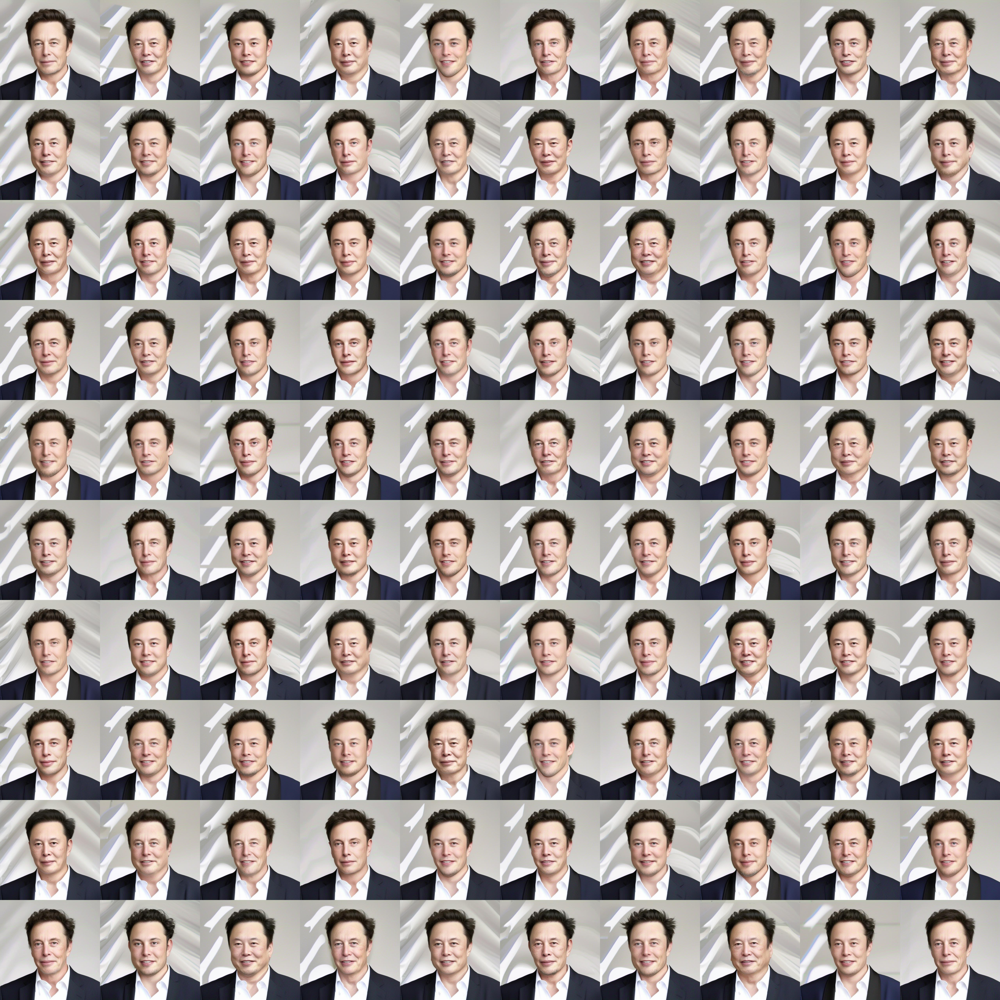
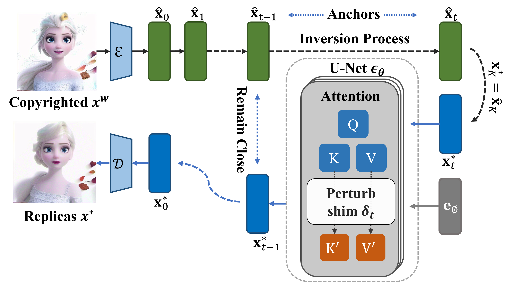

# Neural Plagiarism examples

## Existing experiment illustrations

These are the repository's existing illustrations, unchanged. They are not new outputs from the commands below.

[](../images/elon100.jpg)

[](../images/attack_pipeline.png)

## Check a single-image configuration

Run from the repository root. This check uses only the Python standard library; it does not download models, decode images, run optimization, or create output files.

```bash
python run_attack.py --target_folder samples --start 0 --end 1 --start_step 15 --k 25 45 --eps 10 --iters 10 --output_folder outputs/portrait-example --dry-run
```

One `--eps` value is applied to every selected `--k` step. To set separate bounds, pass `--eps 10 15`. Steps are zero-based indices in the inference schedule, not raw diffusion timesteps. The input selection is sorted by filename and `--end` is exclusive.

## Run the configuration

Install and validate the model environment before removing `--dry-run`. The repository records `torch==2.1.0+cu118`, `torchvision==0.16.0+cu118`, `diffusers==0.19.3`, and `transformers==4.30.2` in `requirements.txt`. That file is a historical environment snapshot, not a newly validated portable installation: it also includes CUDA 12 packages alongside the CUDA 11.8 PyTorch build. This update does not certify that environment or change the paper's algorithm.

The default model is `Manojb/stable-diffusion-2-1-base`; the VAE is `stabilityai/sd-vae-ft-mse`. A first model run can download their weights. Preserve the model choice when comparing runs. No runtime or GPU-memory claim is made here.

```bash
python run_attack.py --target_folder samples --start 0 --end 1 --gen_seed 0 --gpu 0 --start_step 15 --k 25 45 --eps 10 --iters 10 --output_folder outputs/portrait-example
```

This is the original visible-marker example's configuration adapted to the current entry point. It is a starting configuration, not a claim that the bundled portrait contains a watermark or that this command reproduces a reported success rate. GPU execution of this refreshed runner remains to be validated.

## Inspect and share a completed run

Open `outputs/portrait-example/index.html` after a successful run. It displays the processed input, inversion reconstruction, and optimization output. The input uses the same RGB conversion, resize and center crop as the experiment. Image links open the saved files at full resolution.

| Output | Contents |
| --- | --- |
| `config.json` | Parsed arguments and ordered input paths |
| `results.json` | Source filename, seed and image paths for each completed result |
| `image_input_0000.png` | Processed input used by the model |
| `reversed/image_0000_00.png` | Reconstruction for input 0, generated sample 0 |
| `image_attack_0000_00.png` | Optimization output for input 0, generated sample 0 |
| `index.html` | Local comparison page |
| `log.txt` | Optimization log |

Use a fresh output folder for each experiment. `--num_images 2` saves both reconstructions separately. The report updates after each completed result, so a partial run can be inspected. Read `results.json` to see which results actually completed; a report does not mean the entire requested batch finished. If sharing the folder, review `config.json` because it contains your input paths.

## Evaluation boundary

The entry point currently has watermark embedding and detection commented out. `--watermark_text` and `--watermark_method` therefore do not enable watermark evaluation. Visual similarity alone is not a measured protection-bypass result. The original invisible-watermark example referenced `--noisy_start`, which this runner does not implement; removing that flag would change the experiment, so no equivalent reproduction command is claimed here.

`--num_inference_steps` is retained as a legacy argument; this runner uses `--attack_num_inference_steps`. `gamma3` contributes to the logged image-distance term, but the original optimization objective does not include that term.

## Lightweight regression checks

```bash
python -m unittest discover -s tests -v
```

These checks cover command-line validation and result reporting without loading diffusion models. They are not a substitute for numerical or GPU reproduction of the paper.
